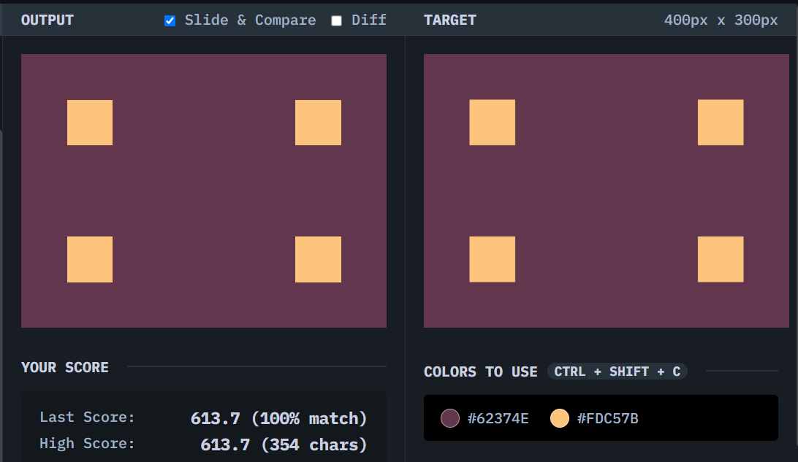

# Carrom

## Solution
### Output

### HTML
```html
<div></div>
<div></div>
<div></div>
<div></div>
```

### CSS
```css
body {
  margin: 0;
  background: #62374e;
  display: grid;
  grid-template-columns: 1fr 1fr;
  grid-template-rows: 1fr 1fr;
  align-items: center;
  justify-items: center;
  column-gap: 100px;
}

div {
  width: 50px;
  height: 50px;
  background: #fdc57b;
}
```

