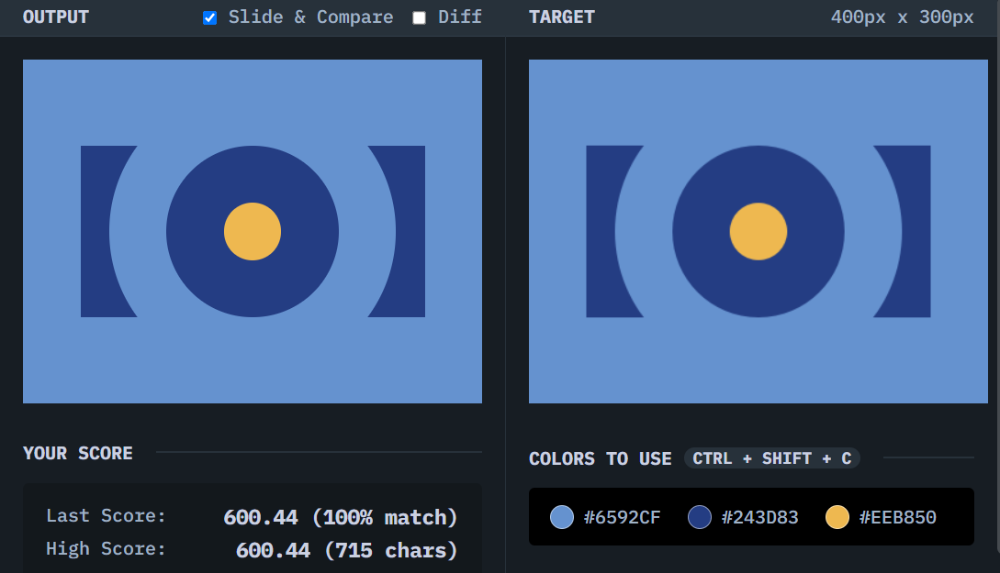

# Push Button

## Solution
### Output

### HTML
```html
<div class="rectangle">
  <div class="circle large">
    <div class="circle medium">
      <div class="circle small"></div>
    </div>
  </div>
</div>
```

### CSS
```css
body {
  margin: 0;
  background: #6592CF;
  display: grid;
  place-content: center;
}

.rectangle {
  background: #243D83;
  width: 300px;
  height:150px;
  display: grid;
  place-content: center;
}

.circle {
  border-radius: 50%;
  display: grid;
  place-content: center;
}

.large {
  width: 250px;
  height: 250px;
  background: #6592CF;
}

.medium {
  width: 150px;
  height: 150px;
  background: #243D83;
}

.small {
  width: 50px;
  height: 50px;
  background: #EEB850;
}
```

