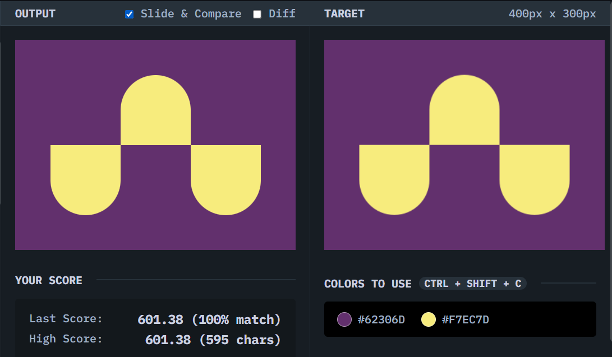

# Ups n Downs

## Solution
### Output

### HTML
```html
<div class="container">
  <div class="shape down"></div>
  <div class="shape up"></div>
  <div class="shape down"></div>
</div>
```

### CSS
```css
body {
  margin: 0;
  background: #62306D;
  display: grid;
  place-content: center;
}

.container {
  display: grid;
  grid-template-columns: repeat(3, 1fr);
  grid-template-rows: 1fr 1fr;
}

.shape {
  background: #F7EC7D;
  width: 100px;
  height: 100px;
}

.up {
  border-radius: 50% 50% 0 0;
  grid-column: 2 / 3;
  grid-row: 1 / 3;
}

.down {
  border-radius: 0 0 50% 50%;
  grid-row: 2 / 3;
}
```

