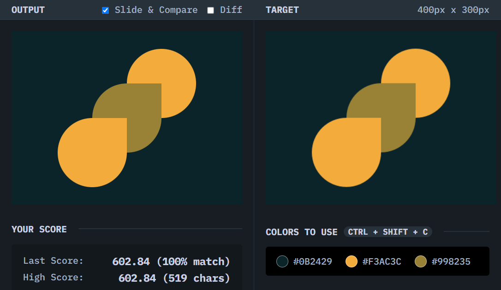

# Acid Rain

## Solution
### Output

### HTML
```html
<div class="shape a"></div>
<div class="shape b"></div>
<div class="shape c"></div>
```

### CSS
```css
body {
  background: #0B2429;
  display: grid;
  place-content: center;
}

.shape {
  width: 120px;
  height: 120px;
  border-radius: 50% 0 50% 50%;
}

.a {
  background: #F3AC3C;
  transform: translate(50%, 50%) rotate(180deg);
  z-index: 1;
}

.b {
  background: #998235;
  z-index: 2;
}

.c {
  background: #F3AC3C;
  transform: translate(-50%, -50%);
  z-index: 3;
}
```

