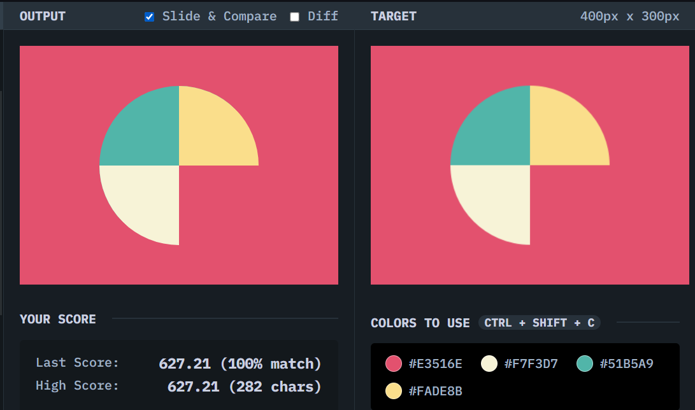

# Missing Slice

## Solution
### Output

### HTML
```html
<div class="circle"></div>
```

### CSS
```css
 body {
  background: #E3516E;
  display: grid;
  place-content: center;
}

.circle {
  border: 100px solid;
  border-radius: 50%;
  border-color: #51B5A9 #FADE8B transparent  #F7F3D7;
  transform: rotate(-45deg);
}
```

