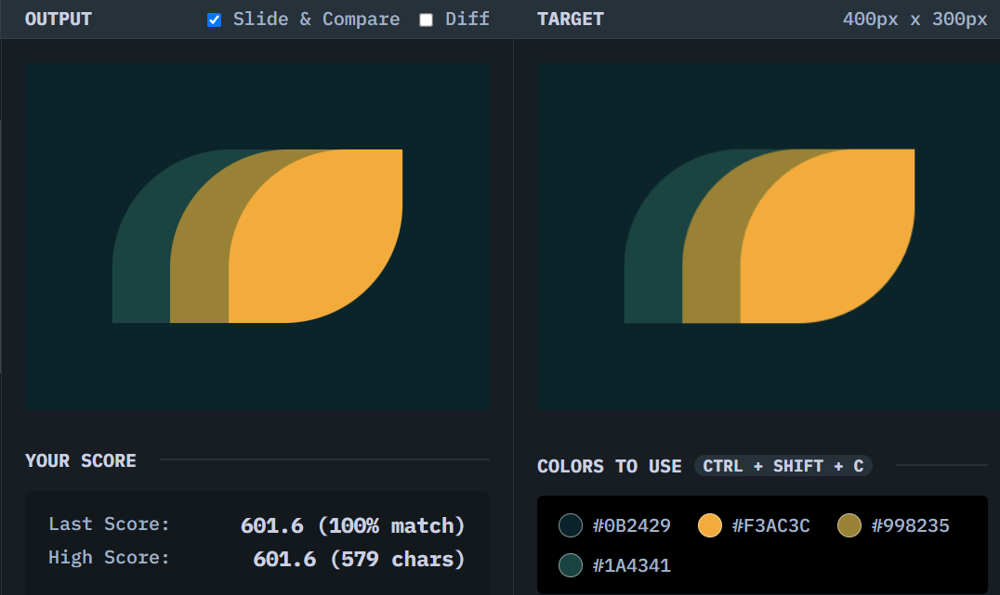

# Leafy-Trail

## Solution
### Output

### HTML
```html
<div class="container">
  <div class="shape a"></div>
  <div class="shape b"></div>
  <div class="shape c"></div>
</div>
```

### CSS
```css
body {
  background: #0B2429;
  display: grid;
  place-content: center;
}

.container {
  display:flex;
}

.shape {
  width:  150px;
  height: 150px;
  border-radius: 68% 0;
}

.a{
  background: #1A4341;
  transform: translateX(66.6%);
  z-index: 1; 
}

  .b {
  background: #998235;
  z-index: 2;
}

.c{
  background: #F3AC3C;
  transform: translateX(-66.6%);
  z-index: 3;
}
```

