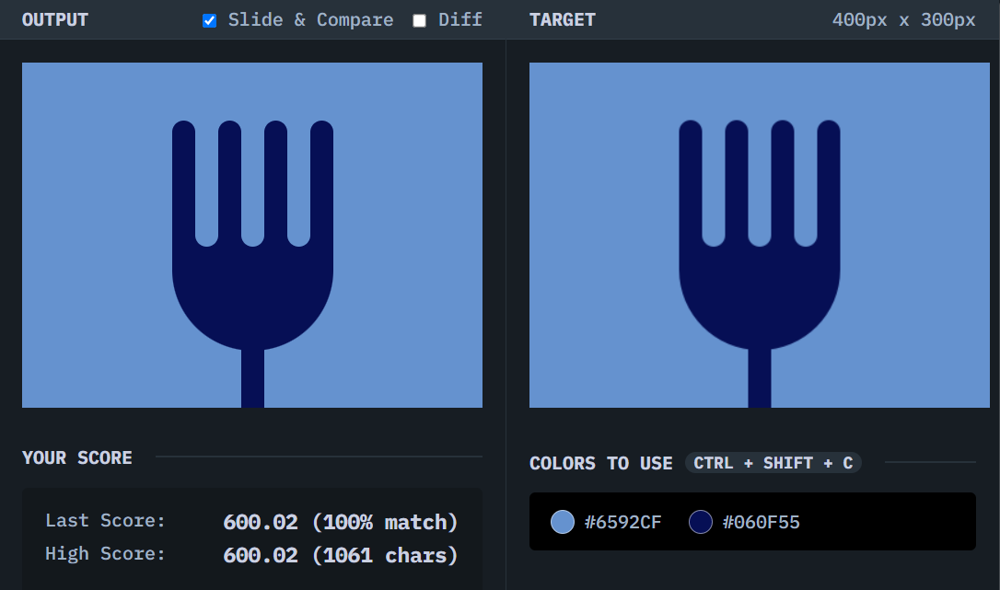

# Forking Crazy

## Solution
### Output

### HTML
```html
<div class="fork">
  <div class="top">
    <div class="pillar"></div>
    <div class="pillar"></div>
    <div class="pillar"></div>
    <div class="pillar"></div>
    <div class="pillar"></div>
    <div class="pillar"></div>
    <div class="pillar"></div>
  </div>
  <div class="mid"></div>
  <div class="bottom"></div>
</div>
```

### CSS
```css
body {
  background: #6592CF;
  margin: 0;
  display: grid;
  justify-items: center;
  align-items: end;
}

.fork {
  width: 140px;
  height: 250px;
}

.top {
  height: 110px;
  display: flex;
}

.pillar {
  width: 20px;
  height: 100%;
  border-radius: 99px;
}

.pillar:nth-child(odd) {
    background: #060F55;
}

.pillar:nth-child(even) {
    background: #6592CF;
}

.mid {
  height: 100px;
  background: #060F55;
  margin-top: -10px;
  border-bottom-left-radius: 110px 110px;
  border-bottom-right-radius: 110px 110px;
}

.bottom {
  width: 20px;
  height: 60px;
  margin-top: -10px;
  background: #060F55;
  transform: translateX(60px);
}
```

