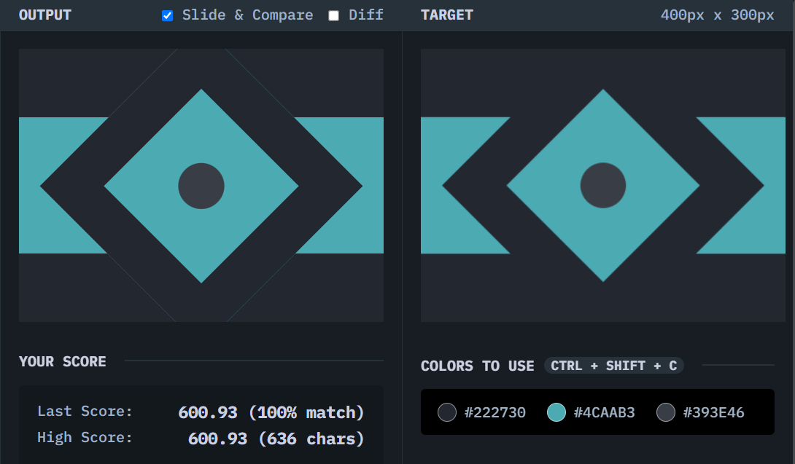

# Tesseract

## Solution
### Output

### HTML
```html
<div class="bg"></div>
<div class="square">
  <div class="circle"></div>
</div>
```

### CSS
```css
body {
  background: #222730;
  margin: 0;
}

.bg {
  background: #4CAAB3;
  width: 400px;
  height: 150px;
  margin-top: 75px;
}

.square {
  box-sizing: border-box;
  width: 250px;
  height: 250px;
  border: 50px solid #222730;
  background: #4CAAB3;
  position: fixed;
  top: 50%;
  left: 50%;
  transform: translate(-50%, -50%) rotate(45deg);
  display: grid;
  place-content: center;
}

.circle {
  width: 50px;
  height: 50px;
  border-radius: 50%;
  background: #393E46;
}
```

