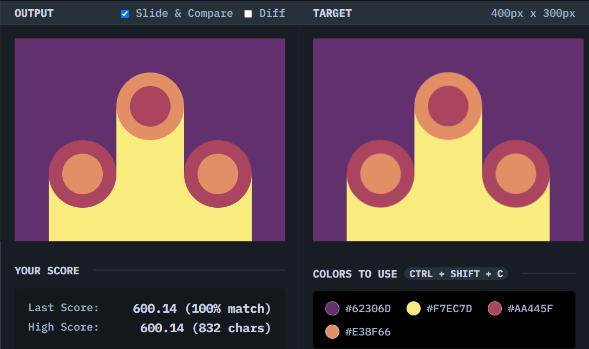

# Cloaked Spirits

## Solution
### Output

### HTML
```html
<div class="container">
  <div class="pillar a"></div>
  <div class="pillar b"></div>
  <div class="pillar c"></div>
</div>
```

### CSS
```css
body {
  margin: 0;
  background: #62306D;
  display: grid;
  align-items: end;
  justify-items: center;
}

.container {
  width: 300px;
  height: 200px;
  display: grid;
  grid-template-columns: 1fr 1fr 1fr;
  align-items: end;
}

.pillar {
  background: #F7EC7D;
  position: relative;
}

.pillar::before {
  content: "";
  width: 100px;
  height: 100px;
  position: absolute;
  top: -50px;
  background: #E38F66;
  border-radius: 50%;
  box-sizing: border-box;
  border: 20px solid #AA445F;
}

.a,.c {
  height: 100px;
}

.b {
  height: 100%;
}

.b::before {
  background: #AA445F;
  border: 20px solid #E38F66;
}
```

