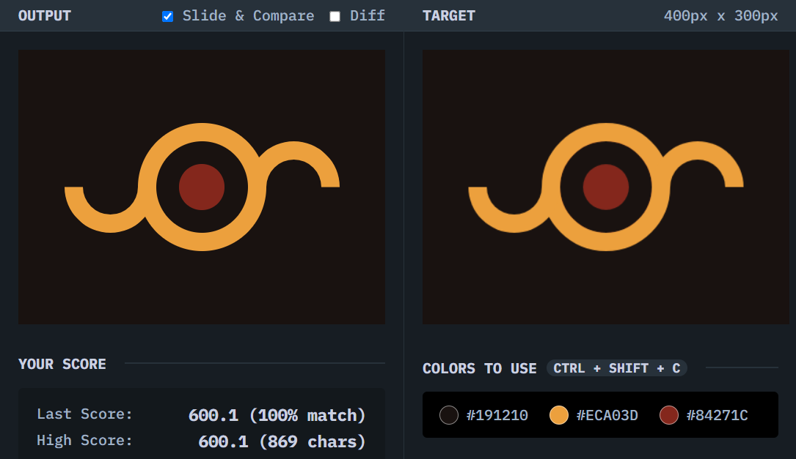

# Eye of Sauron

## Solution
### Output

### HTML
```html
<div class="eye">
  <div class="eyeball"></div>
</div>
```

### CSS
```css
body {
  background: #191210;
  display: grid;
  place-content: center;
}

.eye {
  width: 140px;
  height: 140px;
  box-sizing: border-box;
  background: inherit;
  border: 20px solid #ECA03D;
  border-radius: 50%;
  display: grid;
  place-content: center;
  position: relative;
}

.eye::before, .eye::after {
  content: "";
  width: 100px;
  height: 100px;
  box-sizing: border-box;
  border-radius: 50%;
  border: 20px solid;
  border-color: transparent transparent #ECA03D #ECA03D;
  position: absolute;
}

.eye::before {
  left: -100%;
  transform: rotate(-45deg);
}

.eye::after {
  left: 100%;
  transform: rotate(135deg);
}

.eyeball {
  width: 50px;
  height: 50px;
  background: #84271C;
  border-radius: 50%;
}
```

