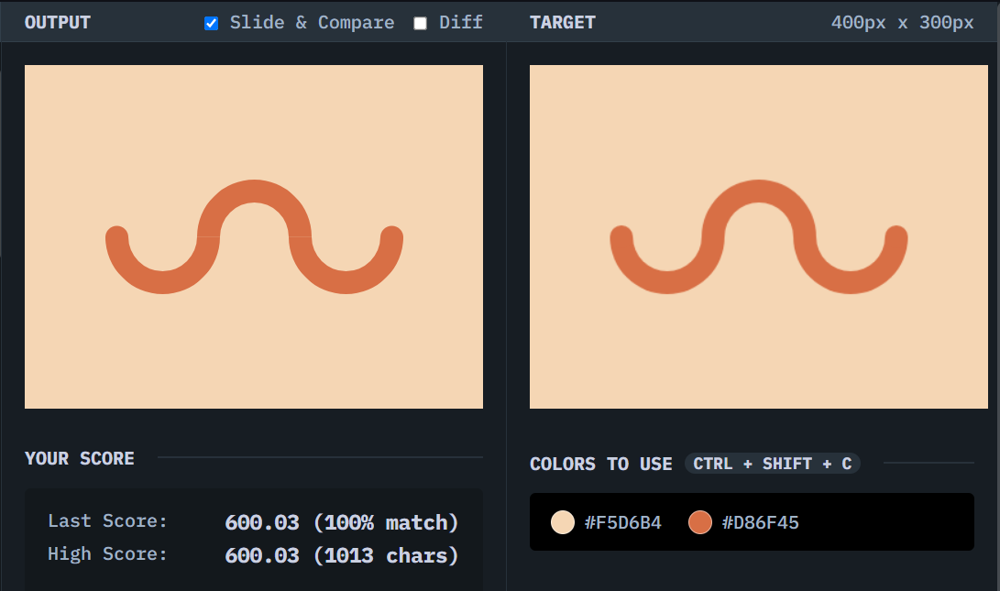

# Wiggly Moustache

## Solution
### Output

### HTML
```html
<div class="container">
  <div class="shape a"></div>
  <div class="shape b"></div>
  <div class="shape c"></div>
</div>
```

### CSS
```css
*,*::before,*::after {
  box-sizing: border-box;
}

body {
  background: #F5D6B4;
  display: grid;
  place-content: center;
}

.container {
  width: 260px;
  height: 100px;
  overflow: hidden;
  display: grid;
  grid-template-columns: 1fr 1fr 1fr;
  position: relative;
}

.container::before, .container::after {
  content: "";
  width: 20px;
  height: 20px;
  position: absolute;
  background: #D86F45;
  border-radius: 50%;
  top: 50%;
  transform: translateY(-50%);
}

.container::before {
  left: 0;
}

.container::after {
  right: 0;
}

.shape {
  width: 100px;
  height: 100px;
  border: 20px solid;
  border-color: #D86F45 #D86F45 transparent transparent;
  border-radius: 50%;
  transform: rotate(-45deg)
}

.b,.c {
  margin-left: -20px;
}

.a, .c {
  transform: rotate(-225deg);
}
```

