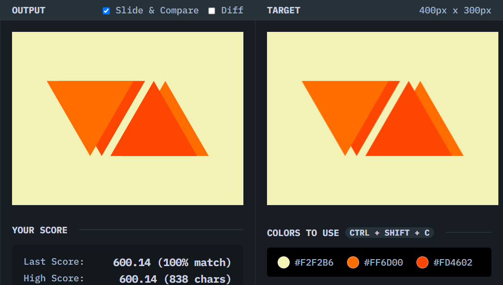

# Web Maker Logo

## Solution
### Output

### HTML
```html
<div class="container">
  <div class="shape a"></div>
  <div class="shape b"></div>
  <div class="shape c"></div>
  <div class="shape d"></div>
</div>
```

### CSS
```css
body {
  background: #F2F2B6;
  display: grid;
  place-content: center;
}

.container {
  width: 280px;
  height: 130px;
  position: relative;
}

.shape {
  width: 150px;
  height: 100%;
  position: absolute;
}

.a {
  background: #FF6D00;
  clip-path: polygon(0 0, 100% 0, 50% 100%);
  z-index: 10;
}

.b {
  background: #FD4602;
  clip-path: polygon(0 0, 100% 0, 50% 100%);
  left: 20px;  
}

.c {
  background: #FD4602;
  right: 20px;
  clip-path: polygon(50% 0, 100% 100%, 0 100%);
  z-index: 10;
}

.d {
  background: #FF6D00;
  right: 0;
  clip-path: polygon(50% 0, 100% 100%, 0 100%);
}
```

