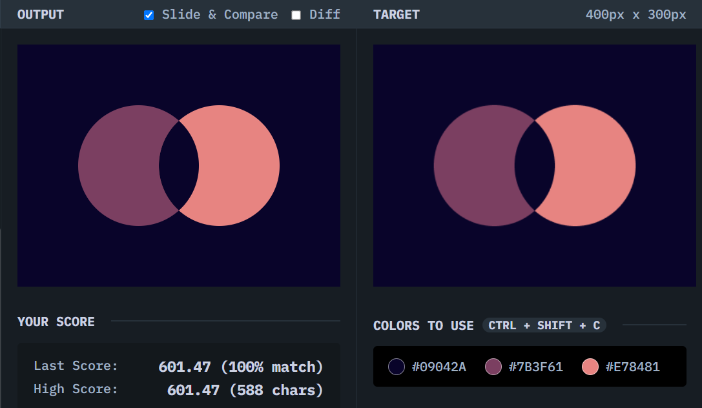

# Overlap

## Solution
### Output

### HTML
```html
<div class="circle left"></div>
<div class="circle right"></div>
```

### CSS
```css
body {
  background: #09042A;
  display: flex;
  align-items: center;
  justify-content: center;
}

.circle {
  width: 150px;
  height: 150px;
  border-radius: 50%;
  position: relative;
  overflow: hidden;
}

.left {
  background: #7B3F61;
  margin-right: -50px;
}

.right {
  background: #E78481;
}

.right::before {
  content: "";
  width: 150px;
  height: 150px;
  background: #09042A;
  border-radius: 50%;
  position: absolute;
  right: 100px;
}
```

