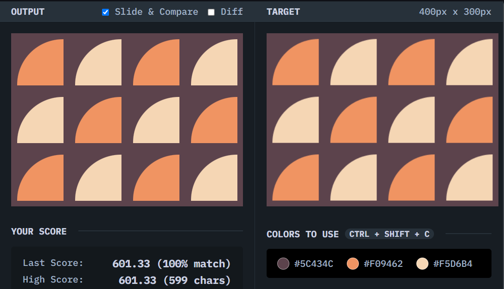

# Matrix

## Solution
### Output

### HTML
```html
<div></div>
<div></div>
<div></div>
<div></div>
<div></div>
<div></div>
<div></div>
<div></div>
<div></div>
<div></div>
<div></div>
<div></div>
```

### CSS
```css
body {
  background: #5C434C;
  margin: 0;
  display: grid;
  grid-template-columns: repeat(4, 1fr);
  grid-template-rows: repeat(3, 1fr);
  justify-items: center;
  align-items: center;
  grid-auto-flow: column;
}

div {
  width: 80px;
  height: 80px;
  background: red;
  border-radius: 100% 0 0;
}

div:nth-child(odd) {
  background: #F09462;
}

div:nth-child(even) {
  background:#F5D6B4;
}
```

